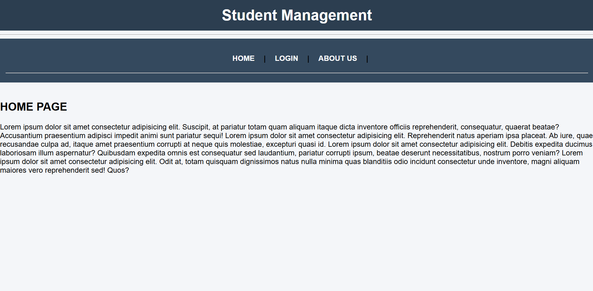
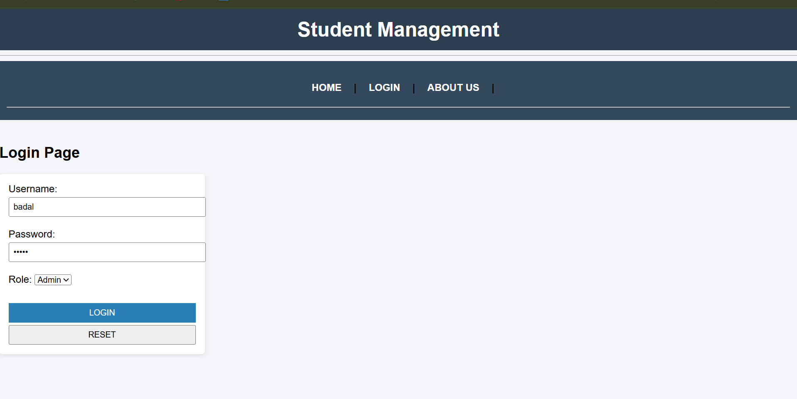
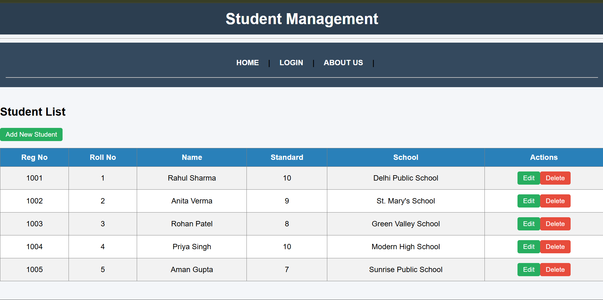

# 🎓 Angular Student Management System


A **Student Management System** built using **Angular** that allows users to manage student records efficiently.
The application demonstrates **CRUD operations**, Angular routing, component-based architecture, and form handling.

This project was developed as part of a **student learning project to understand Angular fundamentals**.

---

# 🚀 Features

* ➕ Add new students
* 📋 View student list
* ✏️ Update student details
* ❌ Delete student records
* 🔎 Search students
* 📱 Responsive UI design

---

# 🛠️ Tech Stack

| Technology       | Description          |
| ---------------- | -------------------- |
| Angular          | Frontend Framework   |
| TypeScript       | Programming Language |
| HTML5            | Structure            |
| CSS3 / Bootstrap | Styling              |
| Angular Forms    | Form Handling        |
| Angular Router   | Navigation           |

---

# 📂 Project Structure

```
src
 ┣ app
 ┃ ┣ components
 ┃ ┃ ┣ student-list
 ┃ ┃ ┣ add-student
 ┃ ┃ ┗ edit-student
 ┃ ┣ services
 ┃ ┃ ┗ student.service.ts
 ┃ ┣ models
 ┃ ┃ ┗ student.model.ts
 ┃ ┣ app-routing.module.ts
 ┃ ┣ app.component.ts
 ┃ ┗ app.module.ts
 ┣ assets
 ┣ environments
 ┗ index.html
```

---

# ⚙️ Installation

## 1 Clone the repository

```
git clone https://github.com/your-username/angular-student-management.git
```

## 2 Navigate to project folder

```
cd angular-student-management
```

## 3 Install dependencies

```
npm install
```

## 4 Run the application

```
ng serve
```

Open browser and go to:

```
http://localhost:4200
```

---

# 📸 Screenshots


Example:

* Student Dashboard
* Add Student Form
* Student List Page







---

# 📚 What I Learned

Through this project I learned:

* Angular component architecture
* Angular routing
* Two-way data binding
* Angular services
* Form handling in Angular
* CRUD operations

---

# 🔮 Future Improvements

* Connect with backend API
* Add authentication system
* Store data in database
* Add pagination
* Add advanced search filters

---

# 👨‍💻 Author

**Badal Singh**

---

# ⭐ Support

If you like this project, consider giving it a ⭐ on GitHub.
